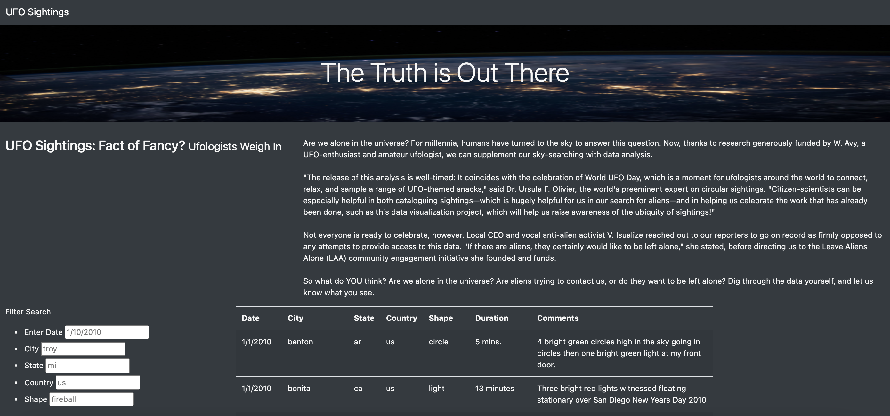
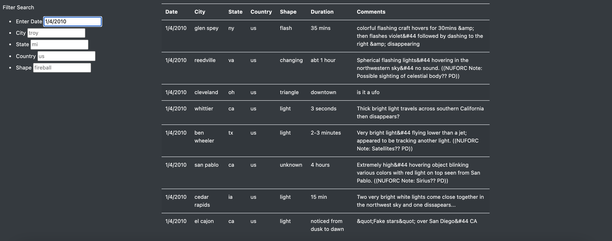
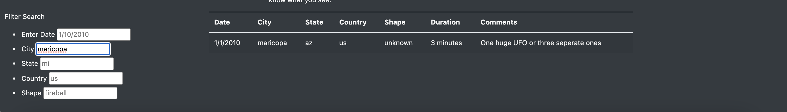
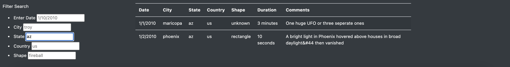
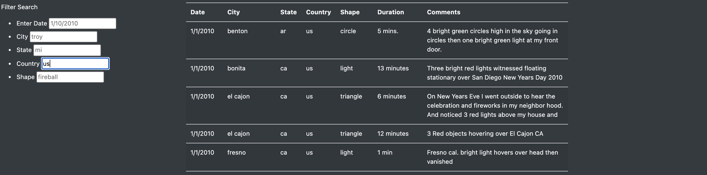
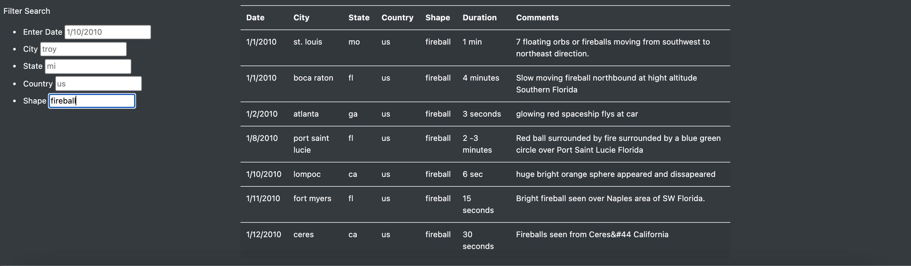

# UFOs
## Overview 
The purpose of this project was to build a dynamic webpage that allows users to interact with the site by filtering search criteria.  Users can filter UFO sightings based on dates, city, state, country and shape.  With each input the webpage will update accordingly to display available information in the table.

## Results
### Homepage
When the site visitor first lands on the homepage it appears like this and contains the full list of available UFO sightings in the table. 

### Date Search
The user can filter the search criteria by inputting the desired date. 

### City Search
The user can filter the search criteria by inputting the desired city. 

### State Search
The user can filter the search criteria by inputting the desired State. 

### Country Search
The user can filter the search criteria by inputting the desired Country. 

### Shape Search
The user can filter the search criteria by inputting the desired shape.

## Summary

